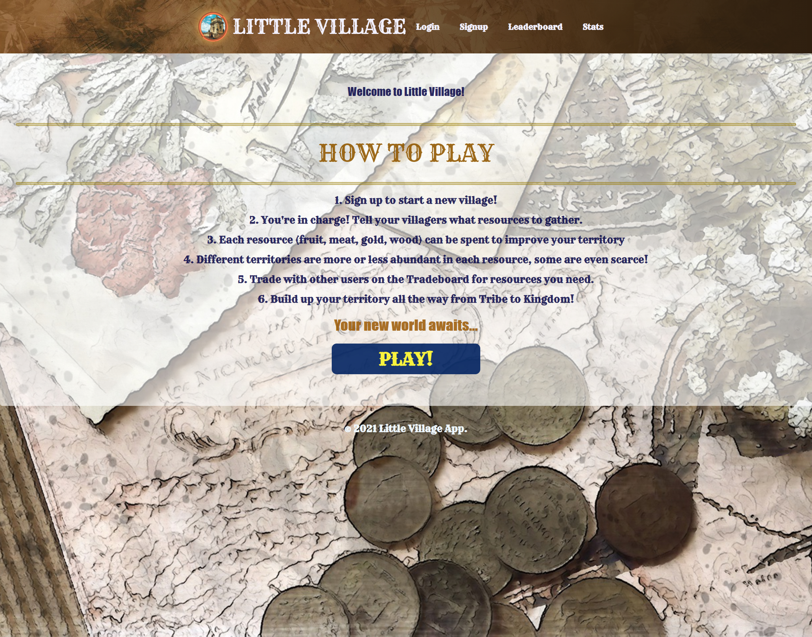
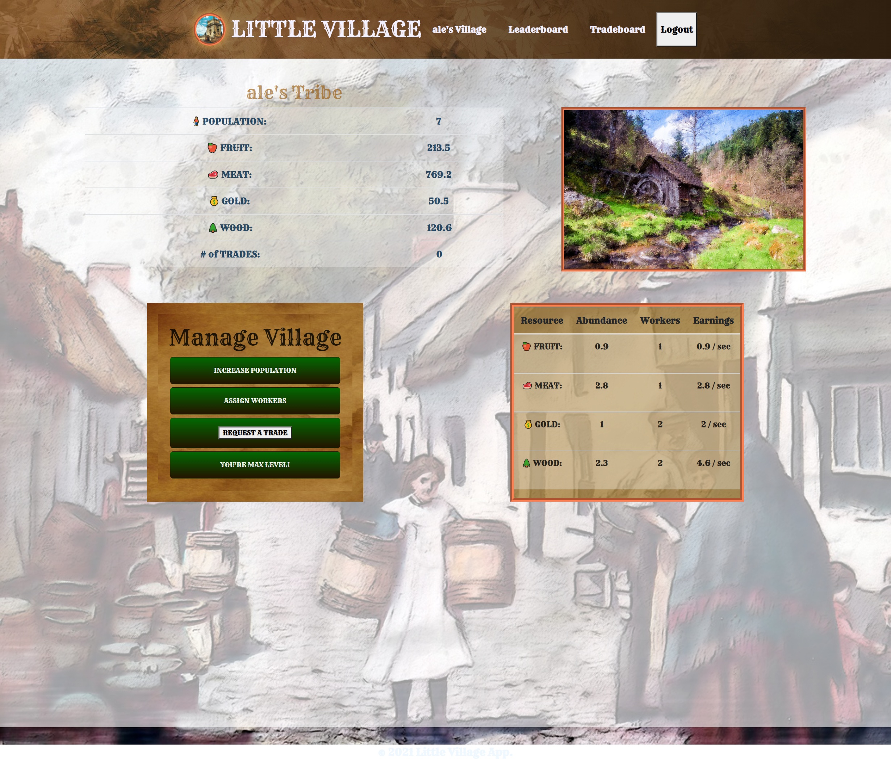
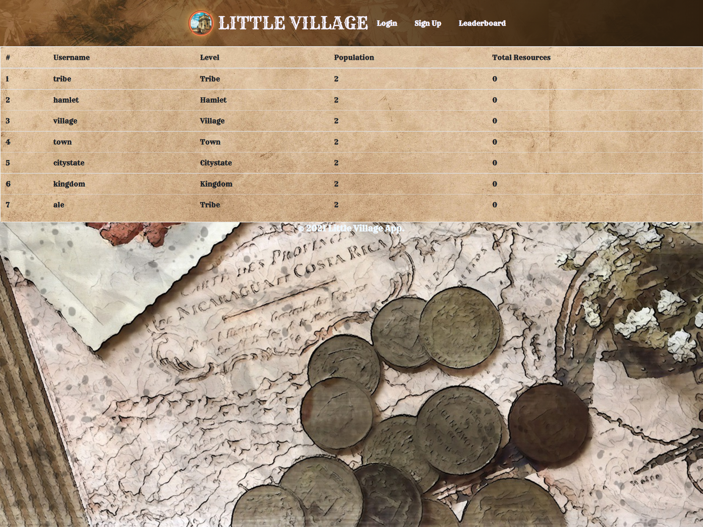
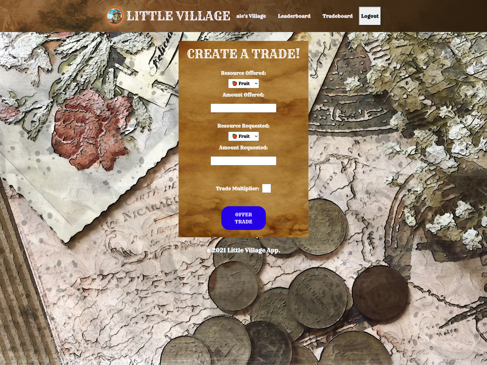

# LITTLE VILLAGE

## Table of Contents

- [Description](#description)
- [Links](#links)
- [Screenshots](#screenshots)
- [Usage](#usage)
- [Collaborators](#collaborators)

## Description 
Little Village is an interactive idle game that fulfills our User's fantasy of running their village. We focused on an efficient user interface and easy-to-understand gameplay for the player. Other things to expect are:

- Creating and customizing your village name.

- Interacting with other players.

- Using a custom database for trades.

### Links 

- [Deployed Site](https://little-village-10292021.herokuapp.com/)
- [Github Repo](https://github.com/asantercureton/little-village)

## Screenshots

## Usage
When the user opens our website they are presented with a quick tutorial.
Once they are familiar with the rules of the game, they can start playing when they sign up!
They will input their name and email, along with a password, and then their village is created!  
Now that they are set up, they can play the game! 
Users hey can be involved in trade, creating more efficient villages and show their prestige in the leaderboards!

The user will experience this game loop follows:

- Buy Goods!
- Collect Materials!
- Assign Your Peasants!
- Trade!
- And Level up! 
- GROW!

## Collaborators
- Lily Sperber (lilywsperber@gmail.com)
- Keri Price (klprice128@gmail.com)
- Alexis Guzman (alexisguzman157@outlook.com)
- Asante Cureton (asantercureton@gmail.com)

- Technologies
    - MERN
    - REACT
    - JAVASCRIPT
    - CSS
    - BOOTSTRAP
    
